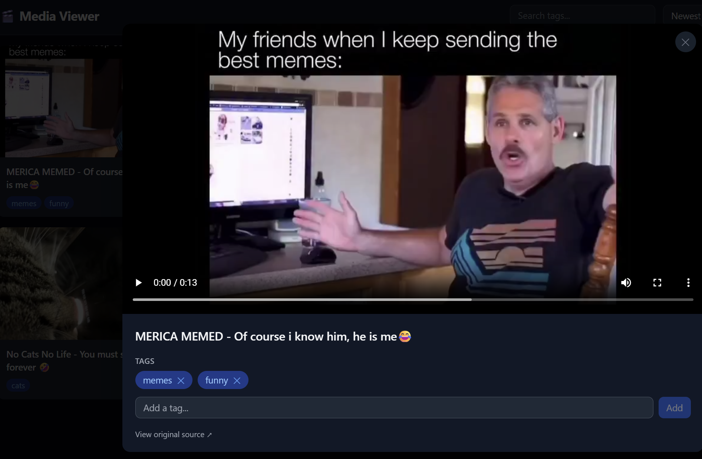

# media-viewer

A self-hosted video viewer designed to pair with [media-roller](https://github.com/rroller/media-roller). Point it at media-roller's download directory and browse, tag, and filter your downloaded videos from a web UI.

## Features

- Browse and play downloaded videos
- Tag videos and filter by tag
- Search tags with autocomplete
- Auto-scans for new videos on startup

## Configuration

| Environment Variable | Default | Description |
|---|---|---|
| `VIDEO_DIR` | `/videos` | Path to video files |
| `DATABASE_URL` | `sqlite:////data/media.db` | SQLite database path |
| `SCAN_ON_STARTUP` | `true` | Scan for new videos on start |
| `PORT` | `8000` | Port to listen on |
